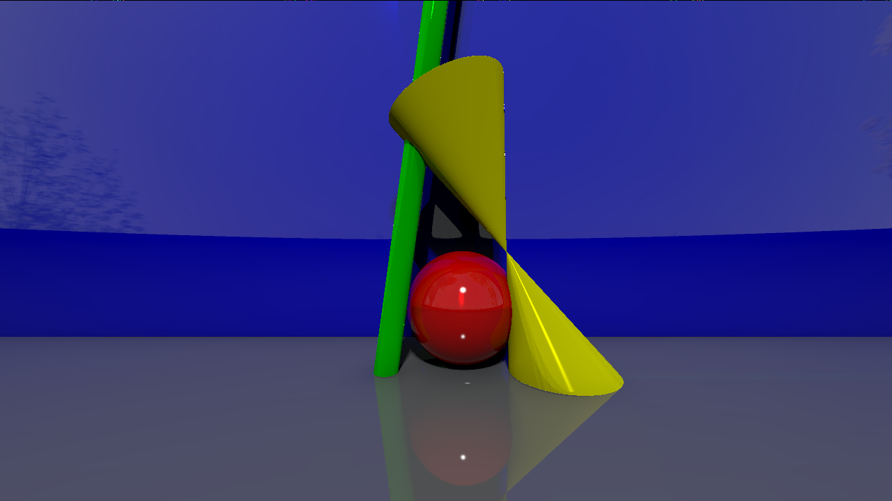
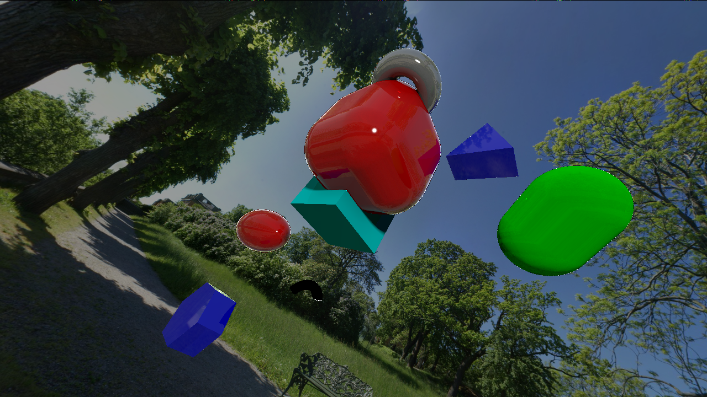
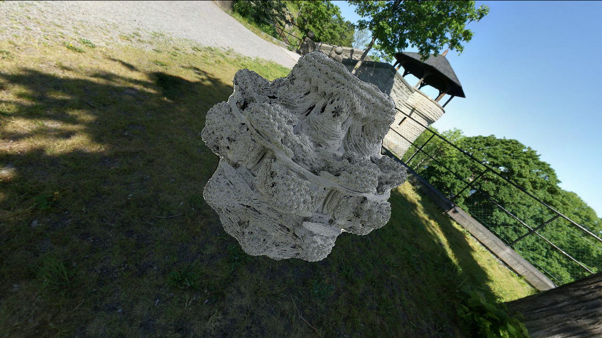
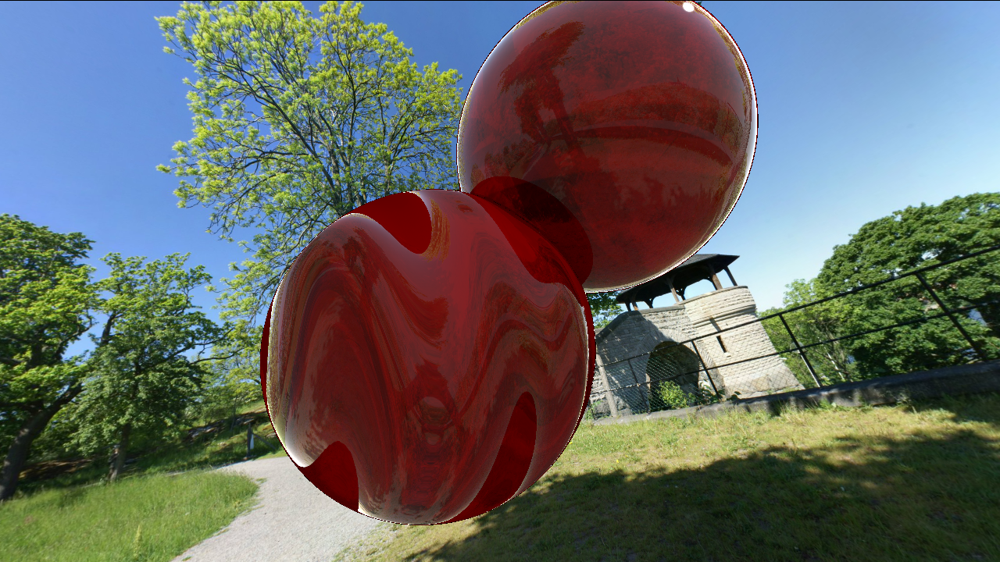
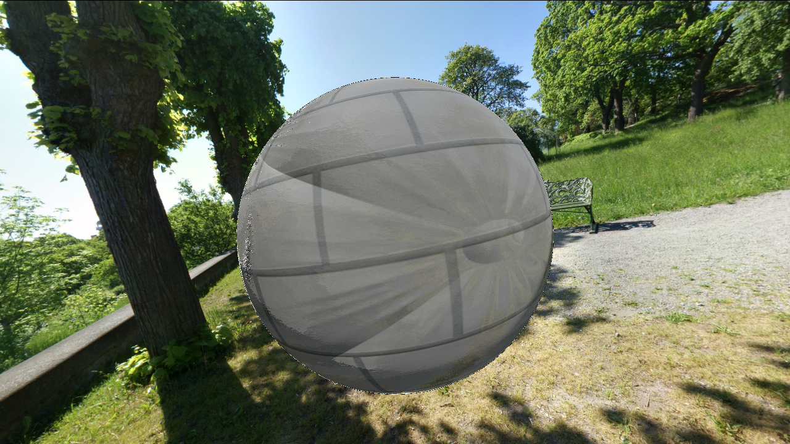
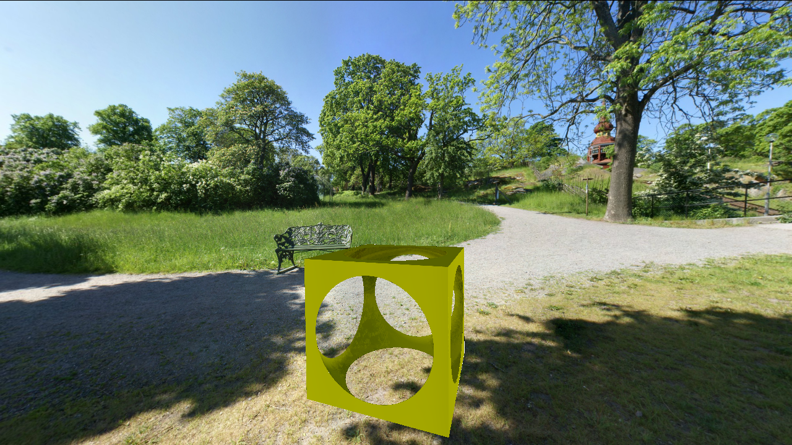

# RT
Ray marching based ray tracer. Currently only OSX supported.  
## How to build
for multithreaded build ```make -j <num threads>```.  
typically, ```make -j 4```.  
## Usage
```./RT <scene>```  
example scenes are given in ./scenes directory  
## Keys
#### Camera movements and rotations
**w a s d q e j k h l** to move and rotate camera?  
**space** to reset camera position  
#### Post processing toggling
**1** for antialiasing  
**2** for carton-filter  
**3** for sepia  
#### Screenshot key
**P** to take screenshot  
## Screenshots
#### Physically based rendering and global illumination...

#### Many objects...

#### Mandelbulb...

#### normal/texture mapping...


#### And constructive solid geometry!

#### Including smoothed versions!


## features
- [x] scene file (1pt)
- [x] scene file follows a structure (1pt)
- [x] use of ambient light (1pt)
- [x] ambient light configurable in config file (1pt)
- [x] cut objects through x,y,z (1pt)
- [x] cut object by position (1pt)
- [x] rotation and translation after cuts (1pt)
- [x] unique cuts for all objects (1pt)
- [x] arbitary cuts (1pt)
- [x] sin noise on normal (1pt)
- [x] checkerboard pattern on color (1pt)
- [x] algorithm to change object's color (sandbox) (1pt)
- [x] Perlin noise pattern on color (1pt)
- [x] Direct light (1pt)
- [x] Parallel light (1pt)
- [x] Mirror reflection (1pt)
- [x] Reflection Rate (1 pt)
- [ ] Transparency (1pt)
- [ ] use of refractive index (1pt)
- [ ] Change of transparency % (1pt)
- [ ] Shadows through transparency (1pt)
- [x] Application of textures on at least 1 object (1pt)
- [x] Application of textures on 4 objects (1pt)
- [ ] Texture Stretch (1pt)
- [ ] Texture Shift (1pt)
- [x] Using a library to load Textures (1pt)
- [x] Normal Mapping (1pt)
- [ ] Texture affects transparency (1pt)
- [ ] Texture defined cut (1pt)
- [ ] Texture on transparent object effectively projects (2pt)
- [x] Composed Objects (one cube made out of quads) (1pt)
- [x] Negative Objects (1pt)
- [x] Simple native objects (1pt)
- [x] Antialising (1pt)
- [x] Cartoon Effect (1pt)
- [ ] Motion Blur (1pt)
- [x] Sepia (1pt)
- [ ] Stereo Display (red/blue) (1pt)
- [ ] Cluster computing (2pt)
- [x] Multi-thread (1pt)
- [x] It is fast (1pt)
- [x] Saving as an image (1pt)
- [x] Graphical waiting msg or Loading Bar (1pt)
- [ ] GUI (GTK) (1pt)
- [x] Live Modification (eye, colors) (1pt)
- [x] Automatic Switching Scenes (1pt)
- [ ] Automatic object creation (1pt)
- [x] Teamwork (1pt)
- [x] Cube Troue (1pt)
- [ ] Table Cloth (1pt)
- [x] Tower (1pt)
- [ ] Custom Distance Functions (1pt)
- [x] Many different objects (1pt)
- [ ] Video about this project RT (1pt)
- [ ] Model Loading (1pt)
- [ ] OculusRift 3D mode (1 pt)
- [x] Lights that are not dots (Area lights) (1pt)
- [ ] Mobius Strip (1pt)
- [x] Global Illumination / Caustics (1pt)
---
39 / 61 points

# Contributors
[mchi - Min Gyu Chi](https://github.com/2ne1ugly)  
[arherrer - Armando Herrera](https://github.com/hexamage)  
[zfaria - Zachery Faria](https://github.com/ZacheryFaria)  
[jcarpio- - Jose Mauricio Carpio Herrera](https://github.com/laughtt)  

